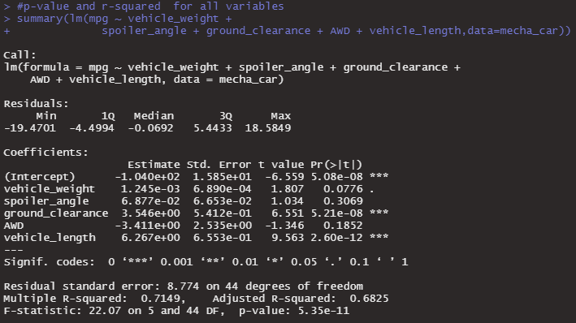
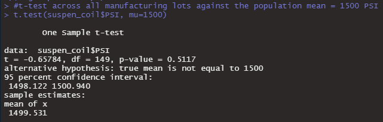
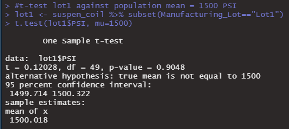
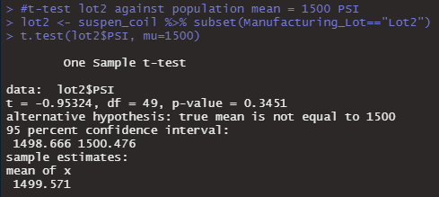
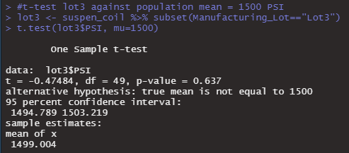

# MechaCar Analysis
*Statistics and R*

## Project Overview
For this project I am performing statistical testing in programing language R for MechaCar car company. Statistical tests provide data-based insight on the company performance and suggest additional testing for comparison of MechaCar company against its competition.

## Resources
Data Source: 
-	[MechaCar_mpg.csv](Data/MechaCar_mpg.csv)
-	[Suspension_Coil.csv](Data/Suspension_Coil.csv)

Software: **RStudio**

Languages: **R**

## Results & Analysis
### D1: Linear Regression to Predict MPG 

#### Statistical question
With multiple linear regression model we are identifying which variables (vehicle weight, spoiler angle, ground clearance, AWD and vehicle length in our case) in the dataset predict the mpg of MechaCar prototypes. In other words, we are asking if there is a relationship between variables and mpg of MechaCar prototypes. 

#### Null hypothesis and alternative hypothesis for linear regression

With multiple linear regression model, we are establishing the following hypothesis:

**H0:** The slope of the linear model is zero, or m = 0 (If there is no significant linear relationship, each dependent value would be determined by random chance and error. Therefore, our linear model would be a flat line with a slope of 0).

**Ha:** The slope of the linear model is not zero, or m ≠ 0 (If there is significant linear relationship, each dependent value would not be determined by random chance and error. Therefore, our linear model would not be a flat line with a slope greater or lesser than 0).

#### Which variables/coefficients provided a non-random amount of variance to the mpg values in the dataset?
To determine which variables, provide a non-random amount of variance to the mpg value we have to look at their individual **p-value**. If the p-value is below 0.05 is statistically unlikely to provide random amounts of variance to the linear model, meaning that those variables have a significant impact on mpg. According to our results *(Figure 1)* **ground clearance** (p-value = 5.21 x 10-8), **vehicle length** (p-value = 2.60 x 10-12), as well as **intercept** (p-value = 5.08 x 10-8) provided a non-random amount of variance to the mpg values in the dataset. 
When an intercept is statistically significant, it means there are other variables and factors that contribute to the variation in mpg that have not been included in the model. These variables may or may not be within our dataset and may still need to be collected or observed (Source 1: Module 15.7.3).
#### Is the slope of the linear model considered to be zero? Why or why not?
Based on our results *(Figure 1)* p-value is 5.35 x 10-11, which is much smaller than our assumed significance level of 0.05%. Therefore, we can state that there **is sufficient evidence to reject our null hypothesis**. That indicates the slope of our linear model is **not** zero, meaning that there is **significant linear relationship** between variables and mpg of MechaCar prototype. (Source 1: Module 15.7.2).
#### Does this linear model predict mpg of MechaCar prototypes effectively? Why or why not?
To determine if this linear model predict mpg of MechaCar prototypes effectively we need to take a look at its **r-squared** and **p-value**. According to our results *(Figure 1)* r-squared is 0.7149 and indicates a strong positive linear relationship, therefore I can confirm that this linear model effectively predicts mpg of MechaCar prototypes (Source 1: Module 15.7.2).

Figure 1: Linear Regression Results.

### D2: Summary Statistics on Suspension Coils
#### The design specifications for the MechaCar suspension coils dictate that the variance of the suspension coils must not exceed 100 pounds per square inch. Does the current manufacturing data meet this design specification for all manufacturing lots in total and each lot individually? Why or why not?
**All lots** The current manufacturing data meet this design specification for all manufacturing lots in total. According to the results *(Figure 4)* shows that variance is 76.23 PSI, that is within requirements of not exceeding variance 100 PSI. 

Figure 2: Summary Statistics on Suspension Coils for All Lots.

**Each lot individually** The current manufacturing data partially meet this design specification for each lot separately. According to the results *(Figure 2)*, it shows that Lot 1 and Lot 2 meet the design specification with a variance is 1.15 and 10.13 PSI respectively, and it is within requirements of not exceeding variance 100 PSI. Lot 3 does not meet the design specification, because of its variance of 220.01 PSI and that exceed the requirements variance of 100 PSI. 

Figure 2: Summary Statistics on Suspension Coils for Each Lot Individually.

### D3: T-Tests on Suspension Coils
I am performing **one-sample t-test**, that is used to determine whether there is a statistical difference between the means of a sample dataset (suspension coil data set) and a population dataset with a given mean of 1,500 PSI. With the t-test, we are establishing the following hypothesis:

**H0:** There is no statistical difference between the suspension coil data set mean and its presumed population mean of 1,500 PSI.

**Ha:** There is statistical difference between the suspension coil data set mean and its presumed population mean of 1,500 PSI.

In order to **reject** or **fail to reject our null hypothesis** we have to look at the **p-value** that determines if there is a statistical difference between the observed sample mean and its presumed population mean.
According to the result *(Figure 3)* p-value for all manufacturing lots is 0.5117, for lot 1 = 0.9048, for lot 2 = 0.3451, and for lot 3 = 0.637. In all cases p-value is above the assumed significance level of 0.05. Therefore, there is not enough evidence and **we fail to reject the null hypothesis**, meaning that the two means not statistically different.

 

Figure 3: t-Test for All Lots Total.

 

Figure 3: t-Test for Each Lot Individually.

### D4 Study Design: MechaCar vs Competition
#### What metric or metrics are you going to test?
Electric vehicles and environmental awareness are on the rise and customers are more cautious about pollution and car emissions. While many customers still cannot afford or won’t invest in the electric vehicle, MechaCar can provide a good alternative. Based on that, I would suggest testing for the following metrics to compare MechaCar against competition: a comparison of a single dependent variable **exhaust system emissions means** across a single independent variable **transmission efficiency** with multiple groups -- in our case -- the competition data.
#### What is the null hypothesis or alternative hypothesis?
To compare MachaCar against competition I would set up the following hypotheses: 

**H0:** The means of exhaust system emissions of all groups are equal.

**Ha:** At least one of the means of exhaust system emissions is different from all other groups.

#### What statistical test would you use to test the hypothesis? And why?
To test the hypotheses, I would use a **one-way ANOVA** test, also known as Analysis of Variance. ANOVA is used to test the means of a single dependent variable across a single independent variable with multiple groups. In our case **exhaust system emissions** of different cars based on **transmission efficiency**. If we reject the null hypothesis, we can conclude that at least one of the means of exhaust system emissions is different from all other groups.

#### What data is needed to run the statistical test?
In order to run this statistical test, we need the data from:
- vehicle ID
- exhaust system emissions data
- transmission efficiency data

Additonally the input data that must be validated prior to using the statistical test:

-	The dependent variable is numerical and continuous, and the independent variables are categorical.
-	The dependent variable is considered to be normally distributed.
-	The variance among each group should be very similar.

## References
-	(1) Module 15. Statistics and R, https://courses.bootcampspot.com/courses/200/external_tools/58, Trilogy Education Services, 2000, Web 23 Oct 2020.

